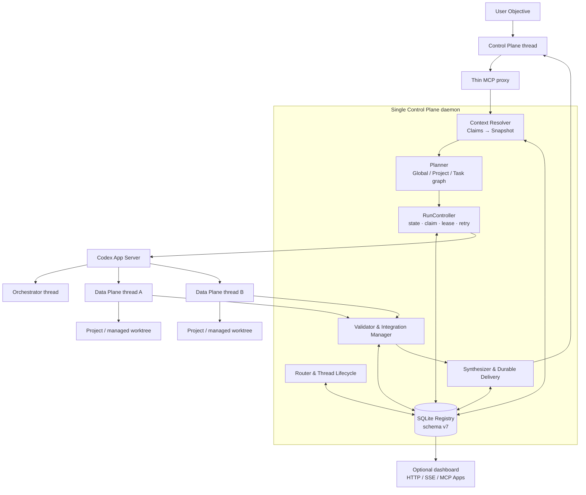

# Codex Agent Control Plane

> 여러 프로젝트와 Codex 스레드에 흩어진 맥락을 근거와 함께 고정하고, 하나의 목표로 안전하게 실행하는 로컬 영속 오케스트레이션 계층입니다.

[](./package.json)
[](./package.json)
[](./docs/G7_E2E_EVIDENCE.md)

Codex를 오래 사용할수록 스레드는 늘어나지만, 중요한 결정과 제약은 여러 대화와 프로젝트에 흩어집니다. 이 프로젝트는 스레드를 더 많이 만드는 도구가 아니라, **어떤 맥락을 왜 선택했는지 기록하고, 검증된 계약 아래 여러 작업을 조정하는 중앙 제어 계층**입니다.

## 한눈에 보기

| 문제 | 해결 방식 |
|---|---|
| 어떤 스레드가 현재 목표를 가장 잘 이해하는지 알기 어렵다 | provenance가 있는 Context Claim을 색인하고 관련성·최신성·권위·충돌을 평가합니다. |
| 맥락이 여러 스레드에 나뉘어 있다 | 계획 전에 immutable Context Snapshot으로 선택 근거와 충돌을 고정합니다. |
| 여러 프로젝트를 하나의 명령으로 관리할 수 없다 | Global Run을 Project Run과 Task DAG로 분해하고 durable handoff로 연결합니다. |
| 작업이 늘수록 영구 스레드가 계속 쌓인다 | lifecycle과 생성 예산을 적용해 `reuse`, `fork`, `spawn`, `ephemeral`, `wait`를 선택합니다. |
| 계약 오류와 재시도로 실행이 반복 실패한다 | strict execution contract, pre-claim gate, fingerprint 기반 retry·repair 정책으로 실행 전에 차단합니다. |
| 데몬 종료나 통합 충돌로 상태가 유실된다 | SQLite Registry, fenced claim, lease, integration journal, durable delivery로 복구합니다. |

## 아키텍처



### 세 Plane의 책임

| Plane | 책임 | 하지 않는 일 |
|---|---|---|
| **Control Plane** | 목표 접수, 맥락 확정, 정책, 계획, 최종 결과 | 긴 구현 작업을 직접 수행하지 않음 |
| **Orchestration Plane** | DAG, 라우팅, 계약, claim/lease, retry, recovery, integration | Planner의 설명을 권한으로 해석하지 않음 |
| **Data Plane** | 할당된 Codex 스레드에서 단일 Task 수행과 evidence 생성 | 형제 Task나 전체 Run 상태를 임의로 변경하지 않음 |

MCP 프로세스는 host-facing transport만 담당하는 얇은 프록시입니다. 하나의 데몬이 Registry, scheduler, App Server writer와 delivery worker를 소유해 여러 Codex 대화가 같은 상태를 안전하게 공유합니다.

## 요청이 실행되는 과정

1. 사용자 목표와 origin thread를 durable Run으로 기록합니다.
2. 관련 Context Claim을 해석하고 immutable Context Snapshot을 확정합니다. 해결되지 않은 동급 충돌은 여기서 차단합니다.
3. Planner가 Global Run → Project Run → Task DAG를 만들고 전체 그래프를 원자적으로 저장합니다.
4. 각 Task의 실행 계약을 compile·validate하고 policy와 workspace preflight를 통과시킵니다.
5. 검증된 Task만 claim하며 Router가 기존 스레드 재사용, fork, 새 스레드, ephemeral 실행 또는 대기를 결정합니다.
6. Worker 결과를 Validator가 검사하고, 필요한 artifact를 managed worktree에서 프로젝트로 통합합니다.
7. 하나의 Result projection을 만들어 origin thread로 직접 전달하거나 durable inbox에서 한 번만 회수합니다.

```text
Objective
  → Context Snapshot
  → Global Run
      → Project Run A → Task DAG → Agent threads
      → Project Run B → Task DAG → Agent threads
      → validated cross-project handoff
  → validation / integration
  → one durable result
```

## 핵심 도메인 모델

| 모델 | 의미 |
|---|---|
| **Context Claim** | 출처 스레드·턴·artifact와 관측 시점을 가진 사실, 결정, 제약 또는 근거 |
| **Context Snapshot** | 한 목표에 사용할 claim과 충돌 판정을 고정한 immutable 입력 |
| **Global Run** | 여러 프로젝트에 걸친 사용자 목표와 전체 결과의 경계 |
| **Project Run** | 한 프로젝트의 권한, workspace, integration과 실패 경계 |
| **Task** | dependency와 acceptance criteria를 가진 최소 실행 단위 |
| **Execution Contract** | sandbox, network, side effect, workspace, output과 fingerprint를 가진 versioned 권한 계약 |
| **Agent / Thread** | Task를 수행하는 Codex 실행 주체와 그 durable provenance |
| **Artifact / Handoff** | 프로젝트 내부 변경 증거와 프로젝트 간 검증된 전달물 |

## 안전 불변조건

- **Snapshot before planning:** 복합 목표는 맥락을 먼저 고정하며, 계획이 암묵적으로 범위나 권한을 넓힐 수 없습니다.
- **Plan is not permission:** 역할명과 Planner prose는 filesystem, network, side-effect 권한을 부여하지 않습니다.
- **Graph before workers:** 전체 그래프와 계약을 검증·저장하기 전에는 Agent, turn, worktree, attempt를 만들지 않습니다.
- **Fenced completion:** 현재 `worker_id + claim_token`이 일치하는 결과만 Task를 완료할 수 있습니다.
- **No identical configuration retry:** 같은 configuration fingerprint로 실패한 계약은 자동 재시도하지 않습니다.
- **Artifact preservation:** 통합되지 않았거나 충돌한 worktree와 artifact는 retain 또는 quarantine합니다.
- **Global goal, local authority:** Global Run도 프로젝트별 sandbox와 authorization 경계를 우회하지 않습니다.
- **One result authority:** 대시보드, 직접 전달, inbox fallback은 같은 durable Result projection을 사용합니다.
- **Dashboard independence:** 대시보드를 열거나 닫는 동작은 실행의 시작·완료 조건이 아닙니다.

세부 규칙은 [아키텍처 정본](./docs/ARCHITECTURE.md)과 [실행 계약](./docs/contracts/EXECUTION_CONTRACT.md)을 따릅니다.

## 주요 기능

### Context와 스레드 라우팅

- 프로젝트와 스레드의 지식·결정·제약을 provenance와 함께 색인
- authoritative claim 충돌 검출과 사용자 resolution revision
- 선택 이유와 score breakdown을 남기는 explainable routing
- `reuse | fork | spawn | ephemeral | wait` 결정
- 스레드 lifecycle, 프로젝트별 생성 예산, compact/supersede/archive 정책

### 실행과 복구

- 중앙 상태 머신과 허용 전이표
- versioned strict execution contract와 pre-claim validation gate
- dependency DAG, 원자적 claim token, Agent/workspace lease
- transient failure만 허용하는 중앙 retry 정책과 contract revision 이력
- managed worktree, 직렬 integration, crash-safe journal과 quarantine
- daemon 재시작 후 active Task, delivery와 handoff 복구

### 다중 프로젝트와 결과 전달

- canonical Project identity와 Global Run / Project Run 계층
- required·optional Project Run 실패 집계
- schema-versioned cross-project artifact handoff와 중복 수신 방지
- origin thread 직접 전달과 durable drain fallback
- 하나의 전역 결과와 프로젝트별 evidence 보존

### 관찰 표면

- SQLite 기반 Agent, Run, Task, lease, memory, event Registry
- 선택형 MCP Apps 대시보드와 로컬 HTTP/SSE fallback
- Run DAG, 현재 작업, 결과, 스레드, 고급 계약 진단
- 대시보드 없이도 계속되는 background execution

## 빠른 시작

요구 사항은 Node.js 20 이상과 로그인된 Codex CLI입니다. 외부 npm runtime dependency는 없습니다.

```bash
git clone https://github.com/ShinYEB/codex-control-plane.git
cd codex-control-plane
node --test
```

CLI로 현재 프로젝트의 스레드를 조회하거나 새 작업을 시작할 수 있습니다.

```bash
PROJECT_ROOT=/absolute/path/to/project

node src/cli.js list --cwd "$PROJECT_ROOT"
node src/cli.js ask \
  --cwd "$PROJECT_ROOT" \
  --prompt "이 프로젝트의 구조와 주요 위험을 분석해줘"
```

쓰기 작업은 sandbox를 명시합니다.

```bash
node src/cli.js ask \
  --cwd "$PROJECT_ROOT" \
  --sandbox workspace-write \
  --prompt "실패하는 테스트를 고치고 다시 실행해줘"
```

기존 스레드 재개와 fork:

```bash
node src/cli.js resume THREAD_ID
node src/cli.js run THREAD_ID --prompt "앞선 분석을 이어서 테스트 전략을 제안해줘"
node src/cli.js fork THREAD_ID
```

Codex Desktop 플러그인으로 배포할 때는 실행 중인 작업과 runtime generation을 먼저 확인해야 합니다. 절차는 [Runtime lifecycle](./docs/operations/RUNTIME_LIFECYCLE.md)을 따르며, 재설치 후에는 새 대화를 열어야 새 MCP generation이 적용됩니다.

## 현재 구현 상태

| 항목 | 상태 |
|---|---|
| Package | `0.14.0` |
| Persistence | SQLite schema v7 |
| Global Run request API | v1 |
| Cross-project handoff schema | v1 |
| 구현 게이트 | G0–G7 완료 |
| 최종 E2E | 12개 시나리오 통과 |
| 전체 테스트 | 234/234 통과 |
| Runtime | Node.js ≥20, 외부 npm dependency 없음 |

릴리스 판정은 특정 테스트 파일이 아니라 전체 suite를 대상으로 합니다.

```bash
pnpm run check
pnpm run test:g7
git diff --check
```

검증 시나리오와 terminal/next action 근거는 [G7 E2E evidence](./docs/G7_E2E_EVIDENCE.md)에 기록되어 있습니다.

## 저장소 구조

```text
src/      daemon, registry, state machine, contracts, routing, MCP/CLI
ui/       embedded dashboard
test/     unit, contract, recovery, integration, E2E tests
docs/     architecture, ADR, contracts, operations, verification gates
scripts/  runtime parity, deployment, reinstall preflight
```

## 문서 지도

| 알고 싶은 것 | 문서 |
|---|---|
| 왜 이 프로젝트가 필요한가 | [제품 목적과 방향](./docs/PRODUCT_DIRECTION.md) |
| 시스템 전체 구조와 책임 경계 | [아키텍처](./docs/ARCHITECTURE.md) |
| 설계 문서 전체 목록 | [설계 문서 인덱스](./docs/README.md) |
| 핵심 용어 | [용어 표준](./docs/TERMINOLOGY.md) |
| 맥락 선택과 충돌 처리 | [Context resolution contract](./docs/contracts/CONTEXT_RESOLUTION.md) |
| 상태와 허용 전이 | [State machines](./docs/contracts/STATE_MACHINES.md) |
| 권한·sandbox·fingerprint | [Execution contract](./docs/contracts/EXECUTION_CONTRACT.md) |
| Global Run과 handoff | [Global runs contract](./docs/contracts/GLOBAL_RUNS.md) |
| SQLite schema와 migration | [Persistence contract](./docs/contracts/PERSISTENCE.md) |
| retry·recovery·integration | [Failure recovery](./docs/operations/FAILURE_RECOVERY.md) |
| 배포·daemon handover·재설치 | [Runtime lifecycle](./docs/operations/RUNTIME_LIFECYCLE.md) |
| 최종 검증 결과 | [G7 E2E evidence](./docs/G7_E2E_EVIDENCE.md) |

## 제품 경계

- 로컬 Codex App Server와 프로젝트를 조정하는 도구이며, 별도 클라우드 오케스트레이션 서비스가 아닙니다.
- 외부 서비스 변경과 파괴적 작업은 Global Run이나 repair UI가 자동 승인하지 않습니다.
- Desktop 사이드바의 폴더·그룹 구조는 host 소유입니다. 이 프로젝트는 스레드 이름, pin 시도, native thread ID handoff를 제공합니다.
- 대시보드는 관찰과 진단을 위한 선택형 표면이며 실행 권한이나 수동 Start gate가 아닙니다.

## 참고

- [Codex App Server 공식 문서](https://learn.chatgpt.com/docs/app-server)
